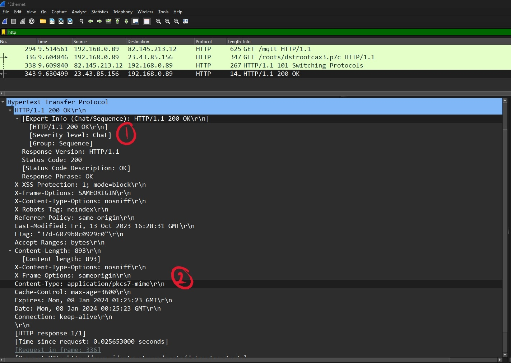

## Queens College
## Internet and Web Technology (CSCI 355)
## Winter 2024
## Assignment 02 - Wireshark
## Essmer Sanchez
## Collaboration: None

---------------------------------------------
### 1. The Basic HTTP GET/response interaction.

Figure 1.1: Client Request

Figure 1.2: Server Response

1. Is your browser running HTTP version 1.0 or 1.1? What version of HTTP is the
server running?

    * Figure 1.1 #1: My browser is running HTTP version 1.1.
  
        `Request Version: HTTP/1.1 `
    * Figure 1.2 #1: The server is running HTTP version 1.1.

         `Response Version: HTTP/1.1`

1. What languages (if any) does your browser indicate that it can accept to the
server?
    * Figure 1.1 #2: My browser indicats that it can accept American English (en-US) and general English (en). With a preference of en-US over en.
  
         `Accepted-Language = en-US, en; q=0.9\r\n` 
1. What is the IP address of your computer? Of the gaia.cs.umass.edu server?
   * Figure 1.1 #3: The IP address of my computer is:

        `192.168.0.89`
   * Figure 1.2 #3The IP address of the server is:

        `82.145.213.12`
2. What is the status code returned from the server to your browser?
   * Figure 1.2 #4: The status code returned is:

        `Status Code: 101`
3. When was the HTML file that you are retrieving last modified at the server?
   * Wireshark did ***NOT*** provide me with a "Last Modified" value.
4. How many bytes of content are being returned to your browser?
   * The number of bytes of content is ***NOT*** displayed.
   * Figuer 1.2 #5: A total length of the package is displayed: 267 bytes.
5. By inspecting the raw data in the packet content window, do you see any headers
within the data that are not displayed in the packet-listing window? If so, name
one.
   * There a **NO** distinguishing headers that can be determind to not be displayed in the packet-listing window.

### 2. The HTTP CONDITIONAL GET/response interaction.

Figure 2.1: Client GET Request 1.

Figure 2.2: Server Resonse 1.

Figure 2.3: Client GET Request 2.

Figure 2.4: Server Resonse 2.

8. Inspect the contents of the first HTTP GET request from your browser to the
server. Do you see an “IF-MODIFIED-SINCE” line in the HTTP GET?
   * Figue 2.1: There is no **"IF-MODIFIED-SINCE"** line in the HTTP GET.
9. Inspect the contents of the server response. Did the server explicitly return the contents of the file? How can you tell?
   * Figure 2.2: I **can not** tell if the server explicitly returned the contents.
10.  Now inspect the contents of the second HTTP GET request from your browser to the server. Do you see an "IF-MODIFIED-SINCE:” line in the HTTP GET? If so, what information follows the “IF-MODIFIED-SINCE:” header?
     * Figure 2.3: The second HTTP GET request **does not** display an **"IF-MODIFIED-SINCE:"** line.
11.  What is the HTTP status code and phrase returned from the server in response to
this second HTTP GET? Did the server explicitly return the contents of the file?
Explain.
     * Figure 2.4 #1: Status code: `200`.
     * Figure 2.4 #1: Phrase Returned: `OK`.
     * Figure 2.4 #2: It seems that the server did not explicitly return the contents of the file. 
  
        `Content Type: application/pkcs7-mime\r\n`
    This indicats that the returning data is encrypted.

### 3. Retrieving Long Documents.

Figure 3.1: Client and Server.

Figure 3.2: Server Response.

1.   How many HTTP GET request messages did your browser send? Which packet
number in the trace contains the GET message for the Bill of Rights?
     * Figure 3.1 #1.1: The brower sent only one HTTP GET request.
     * Figure 3.1 #1.2: There are six (6) different packets that contain the GET message for the Bill of Rights.
1.  . Which packet number in the trace contains the status code and phrase associated with the response to the HTTP GET request?
    * Unable to determine the packet number.
2.  What is the status code and phrase in the response?
    * Figure 3.2 #1: `Status Code: 101`
    * Figure 3.2 #1: `Respond Phrase: Switching Protocols`
3.  How many data-containing TCP segments were needed to carry the single HTTP response and the text of the Bill of Rights?
    * Figure 3.2 #1.3: Four (4) TCP segments were needed: 218, 220, 265, 266.

### 4. HTML Documents with Embedded Objects.

Figure 4.1: Client and Server.

16. How many HTTP GET request messages did your browser send? To which Internet addresses were these GET requests sent?
    * Figure 4.1 #1: Wireshark displays only one (1) GET request. Maybe due to the browser (Opera Crypto) it is only displaying one but since there are multiple images, it should probably be three (3) GET requests.One for making the request and the other two for obtaining the images.
    * Figure 4.1 #1: Only able to determine one Internet address: `23.33.46.35`.
17. Can you tell whether your browser downloaded the two images serially, or whether they were downloaded from the two web sites in parallel? Explain.
    * **Unable** to tell.

### 5. HTTP Authentication

Figure 5.1: Client.

Figure 5.2: Server.

1.  What is the server’s response (status code and phrase) in response to the initial HTTP GET message from your browser?
    * Figure 5.2: `Status Code: 101`
    * Figure 5.2: `Respond Phrase: Switching Protocols`
2.  When your browser’s sends the HTTP GET message for the second time, what new field is included in the HTTP GET message?
    * Figure 5.1: Only able to see one (1) GET message.