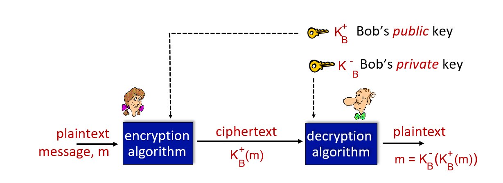

## Queens College
## Internet and Web Technology (CSCI 355)
## Winter 2024
## 1/11 Ch: 8 Internet Security Notes
## Essmer Sanchez
## Collaboration: None

### Internet Security

#### What is network security?
Goals: CIA 
* **C**onfidentiality: Do not allow other (non-intended) actors to have access to our data.
  * Not so simple in the context of networking. Analogy: driving in the highway, everyone can see you and your car.
* **I**ntegrity: ensure data is not altered in any way.
* **A**uthentication/Availabilty: Sender, receiver confirm their identities and services must be accessible and available to users.

Goals addressed in different ways.

Scenarios:

Alice and Bob want to communicate but Trudy may intercept, delete, add messages.

Alice and Bob can represent:
* Actual people trying to communicate, exchange information.
* Web browser/server
* On-Line banking client/server
* DNS server
* BGP routers: Border Gateway Protocol (standard inter-AS protocol)

Trudy can perform:
* Eavesdrop: ex. using Wireshark to see what people are doing.
* Insert messages. 
* Impersonate.
* Hijack
* DoS: Denial of Service, overwhelming a server with activity that it does not have time for anything else.
* DDoS: Distributed Denial of Service:
  * more volume, generate bad traffic
  * harder to track

Answer?: Cyptography
#### CRYPTOGRAPHY

* m = message
* K(A) = encryption key
* K(B) = decryption
* ciphertext = plaintext packet that has been encrypted.

Question: How much of the packet do you encrypt?
* Can be super secure that it can become useless.

Shift-Cipher: Simple, shifting letters by a set amount. Ex. bump A to become D, B to E, etc.
* Encryption shifts forward
* Decryption shifts backward
* 26 possible shifts if using english alphabet, can be more if others used.

Permutation-Cipher: "A" gets mapped to "E" but "B" gets mapped to "X". Leads to 26! possibilities.

Breaking Encryption Schemes:
* Use brute force. Shift-cipher can be easily cracked.
* Statistical Analysis.
* Trudy has the plaintext corresponding to ciphertext.

**Symmetric Key Cryptography**

Bob and Alice share same (symmetric) key: K

Permutation-cipher that uses an encryption key that maps from a set of 26 letters to a set of 26 letter (26!).

To make more difficult: have several permutation ciphers and alternate between them but it needs to be known/shared, this is still risky.

**DES: Data Encryption Standard**
* Symmetric key.
* Chopped into chunks.
* Not that good in modern day since it can be decrypted by brute force.
* 1 sec to decrypt with modern technology.

**AES: Advanced Encryption Standard**
* Symmetric key.
* Harder than DES, 149 trillion years to decrypt using brute force.

**Public Key Cryptography**: Highlight
* How can something public be secret?
* RSA78
* public encryption key known to all, can be accessed.
* private decryption key known only to receiver.
* Not a symmetric key, just because you know how to encrypt doesn't mean you know to decrypt.
Ex: A bank wants people to send it data, the bank publishes the encryption key but only the customer knows the decryption.

Alice wants to send an encrypted message to Bob:
* Alice uses Bob's public key to encrypt.
* But only Bob's private key can decrypt.
* Bad actors do not know Bob's private key, not even Alice.

**RSA**: Encryption/Decryption algorithm developed by Rivest, Shamir, Adelson
0. given (n,e), public key, and (n,d), private key.
   * n = product of two large prime numbers, p and q (ex: 1024 bits, ~10^300 range).
   * e < n, e has no common factors with z
   * z = (p-1)(q-1)
   * d = (e*d) - 1 is exactly divisible by z ((e*d)mod z = 1)
1. to encrypt message m (<n) compute c = m^e mod n
   * Take message and convert to binary number
   * Take binary and convert to decimal
   * Take decimal and raise to e power.
2. to decrypt received bit patter c, compute m = c^d mod n

Magic: m = (m^e mod n)^d mod n
* the relationship between e and d is such that they cancel each other out and get back m.
* e and d are carefully chosen
* whole world knows e, but they don't know d.
* n ~ 10^700
* nature of e and d is such that they can be interchanged and result in the same thing. Ex: (A^B)^C = (A^C)^B
  * useful depending on what is trying to be accomplished.
* Can be used as integrity.

Problem: SLOW to work with.
Trick: Use some RSA to share the permutation cipher then use permutation cipher for the remainder of the sessions.
* Two-phased model

#### Authentication
How to use cryptography to achieve goals?

Failure Scenario 1: 

* AI can be used to replicate the "voice" tricking Bob to think it is Alice.
    
Failure Scenario 2:

* Alice sends from her own IP address.
* Trudy spoofs Alice's IP address, Bob recognized IP address and is tricked.

Failure Scenario 3:

* Alice uses a password in the message that Bob recognizes.
* Trudy can read channel, sees weird characters that is the PW. She records and uses the same PW to trick Bob.

Failure Scenario 4:

* Alice encrypts password.
* Bob see's something encrypted and understands its Alice.
* Problem: Trudy, since she is monitoring, uses the same encrypted password.

Failure Scenario 5:

* Bob sends a **naunce** message, used once in a lifetime. 
* Alice sends the **naunce** back to Bob encrypted.
* Will not be the same each time.

* Trudy sits in between and wrecks havoc.

#### Digital Signatures
* Analogous to hand-written signatures, ex: pdf's.
* **Message Digest** (MD): ex MD5 available in databases, SQL.
  * Kind of a hash
  * SHA-1 also used
  * MD5 is large, must make sure there is enough space in DB to store MD5.
* **Internet CheckSums**:

#### Need for certified public keys
* ex. pizza shop asks for payment in advance.
* **Certificate Authority** (CA) needed to certify users. To record/validate identity for access to a public key.

#### Secure Email: REMEMBER FOR EXAM!!

* Which side is the public key, private key in terms of confidentiality?
  * Sent with the public key. Only one who can decrypt it is the recipient.
* For message integrity and authentication, it's the other way around.
  * Use the private key to encrypt, anyone can decrypt it with the public key but only the individual can do it.

#### Transport-layer Security (TLS)
* A combination of message integrity, authentication and confidentiality. 
* Together with HTTP makes HTTPS.
* Provides:
  * confidentiality - via symmetric encryption (NOT RSA, instead permutation ciphers types).
  * integrity - via cryptographic hashing (if someone were to change one pixel or character, you will find out about it since it will be different)
  * authentication - via public key cryptography.

* top light-gray exchange is standard three-way handshake.
* Problem: 3 RTT (Round Trip Time). A lot of overhead.

#### T-TLS: Encrypting Data
* Possible issues:
  * Re-ordering: man-in middle intercepts TCP segments and reorders
  * Changing the sequence makes putting it back together a problem.
  * Connection closure: attacker forges TCP connection close segment. Must check if legitimate closure.

HTTP View of TLS:

* HTTP 1.0 has no security
* HTTP/2 (HTTPS) is HTTP + TLS
* HTTP/3 uses QUIC, not using TLS works around it.

Some approaches attempt to wrap more of the cryptography earlier on in the exchange.

#### Where does this cryptography happen?
* Application Layer:
  * In computer email client applications
  * ZIP, using WinZip PW protection
  * VPN essentially
  * People don't want to bother with encryption.
* IP Layer/Network Layer:

  * Encrypted data sitting inside another data is sometimes done.

#### 802.11: WIFI Authentication, Encryption

* Easier to listen to something as opposed to wired.
* Need to establish a wireless connection to an access point (AP).
* Can be unreliable.

#### FIREWALLS: IMPORTANT TOPIC
* Gets name from construction to slow down the spread of fire.
* In our context:
  * Keep things in: ex: company employee attempts to leak secrets to sell.
    * Company firewall looks at all communication going out.
  * Main thing, Keep things out:
    * Have a white-list of IP addresses that are allowed.
      * Doesn't necessarily prevent someone from impersonating someone else.
    * Have a black-list of bad actor IP addresses to deny entry.
    * Packet filter: if anyone sends anything to a webserver not on port 80, for example, that is a red flag.
      * Why are they sending other things? Suspicious.
    * Ex of a packet filter: **Access Control List** (ACL)

#### Intrusive Detection Systems
* Deep packet inspection
  * looks at data itself for virus, malware
    * virus' can be in images since it's an executable file.

